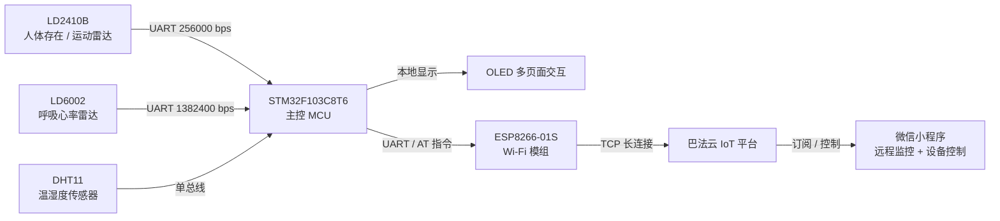

# 多模态感知智能家居健康管理系统

> 基于 **STM32F103C8T6 + 双毫米波雷达 + ESP8266** 的非接触式家居健康感知系统，实现人体存在、运动状态、呼吸/心率、温湿度采集，并通过 Wi-Fi 上云联动微信小程序进行远程监控。


毕业设计 · 独立完成 · 2025.10 – 2026.05

> 说明：本项目为本科毕业设计与嵌入式求职作品集项目，重点展示 STM32 外设驱动、串口协议解析、状态机算法、软硬件联调和端云通信能力。

---

## 项目快速看点

这个项目主要体现以下嵌入式开发内容：

- **高速 UART 数据接收**：针对 LD6002 1382400 bps 非标波特率，使用 USART 中断 + 环形缓冲区实现接收解耦。
- **协议解析状态机**：自主实现 LD2410B 定长帧与 LD6002 变长帧解析，包含帧头同步、长度解析、校验和校验与错误恢复。
- **嵌入式软件架构设计**：采用应用层、设备层、组件层、驱动层的分层结构，提升代码可维护性。
- **传感器数据处理**：对呼吸/心率数据加入范围约束、中位数滤波和时间一致性判断，提升显示稳定性。
- **状态机算法设计**：实现人体存在防抖与久坐识别状态机，降低瞬时误判造成的误提醒。
- **端到端系统联调**：完成 STM32 本地采集、OLED 显示、ESP8266 上云、微信小程序远程监控的完整链路。
- **软硬件问题定位**：针对雷达供电敏感、ESP8266 启动电流大、串口数据量高等问题进行独立排查与优化。

---

## 项目亮点

- **非接触式感知**：使用毫米波雷达进行人体状态与生命体征检测，无摄像头、无需佩戴设备，适合家居健康监测场景。
- **多模态数据融合**：集成人体存在/运动状态、呼吸/心率、温湿度等多类数据，并统一上报云端。
- **通信可靠性设计**：通过环形缓冲区、校验和、状态机重同步机制，降低高速串口数据丢失和误解析风险。
- **云端闭环控制**：基于 ESP8266 AT 指令接入巴法云 TCP 长连接，实现远程数据显示、状态同步和简单设备控制。
- **工程化实现**：独立完成硬件选型、模块接线、固件开发、云端接入、测试验证和问题排查。

---

## 实测性能指标

| 指标 | 结果 | 测试方法 |
| --- | --- | --- |
| 人体存在检测准确率 | **96%** | 4–5 m 范围内人为进出 100 次，显示与实际一致计为正确 |
| 呼吸频率误差 | **±4 bpm** | 以人工计数为基准，多次测量后统计平均绝对误差 |
| 端到端云端延迟 | **< 5 s** | 记录“传感器状态变化 → 微信小程序刷新”的时间差 |
| 连续稳定运行 | **72 h 无 MCU 重启** | 长时间运行，观察系统重启、云端断连与显示异常情况 |
| 整机物料成本 | **约 188 元** | 按实际采购模块与元件成本估算 |

> 注：该系统主要用于工程展示与嵌入式开发能力验证，呼吸/心率数据未经过医疗级设备标定，不作为医疗诊断依据。

---

## 系统架构



---

## 硬件设计

### 主要硬件

| 模块 | 型号 / 方案 | 作用 |
| --- | --- | --- |
| 主控 MCU | STM32F103C8T6 | 外设控制、数据解析、状态机调度 |
| 人体存在雷达 | LD2410B | 人体存在、运动状态检测 |
| 呼吸心率雷达 | LD6002 | 呼吸、心率、距离等数据采集 |
| 温湿度传感器 | DHT11 | 环境温湿度采集 |
| Wi-Fi 模组 | ESP8266-01S | 通过 AT 指令接入云平台 |
| 显示模块 | OLED | 本地数据显示与页面切换 |
| 电源方案 | 独立 LDO + 滤波电容 | 降低雷达与 Wi-Fi 模组供电干扰 |

### 硬件连接表

> 请根据实际原理图或代码中的引脚定义修改下表中的 GPIO。上传前建议把 `GPIOx` 替换成真实引脚。

| 模块 | 接口 | STM32 引脚 | 说明 |
| --- | --- | --- | --- |
| LD2410B | UART | USART1 TX/RX | 人体存在 / 运动状态检测 |
| ESP8266-01S | UART | USART2 TX/RX | Wi-Fi 上云与下行控制 |
| LD6002 | UART | USART3 TX/RX | 呼吸 / 心率 / 距离数据 |
| DHT11 | 单总线 | GPIOB P0 | 温湿度采集 |
| OLED | I2C / GPIO | GPIOB P6 P7 | 本地数据显示 |
| 按键 | GPIO | GPIO | 页面切换 / 参数配置 |
| LED / 风扇 | GPIO | GPIOA P8 | 状态指示 / 简单执行控制 |

### 电源设计要点

- LD6002 对电源纹波较敏感，采用独立低纹波 LDO 供电，降低数据异常波动。
- ESP8266 启动和发射瞬间电流较大，单纯依赖开发板板载 3.3 V 输出容易导致复位或连接异常，因此增加独立稳压与大电容滤波。
- 雷达、Wi-Fi 模组、MCU 之间共地，保证串口通信电平参考一致。

---

## 软件架构

项目采用四级分层结构，尽量降低业务逻辑、设备驱动和底层外设之间的耦合。

| 层级 | 职责 | 代表内容 |
| --- | --- | --- |
| 应用层 | 主循环调度、业务编排 | 页面刷新、数据上报、状态控制 |
| 设备层 | 封装具体芯片逻辑 | LD2410B、LD6002、DHT11、ESP8266、OLED |
| 组件层 | 可复用算法模块 | 环形缓冲区、滤波器、久坐状态机 |
| 驱动层 | MCU 外设操作 | USART、GPIO、定时器、中断 |

### 仓库结构

> 下方为推荐整理后的仓库结构。上传前请尽量让代码目录与 README 保持一致。

```text
.
├── App/                     # 应用层：主循环调度与业务逻辑
│   └── main.c
├── Device/                  # 设备层：具体模块驱动封装
│   ├── ld2410b.c / .h
│   ├── ld6002.c  / .h
│   ├── dht11.c   / .h
│   ├── esp8266.c / .h
│   └── oled.c    / .h
│   └── Bemfa.c    / .h
├── Component/               # 组件层：通用算法与数据结构
│   ├── ringbuffer.c / .h
│   ├── filter.c     / .h
│   └── sedentary.c  / .h
├── Driver/                  # 驱动层：USART、GPIO、Timer 等
│   ├── usart.c / .h
│   ├── gpio.c  / .h
│   └── timer.c / .h
├── Doc/                     # 文档、框图、截图、演示 GIF
├── README.md
└── LICENSE
```

---

## 核心技术实现

### 1. LD2410B 定长帧解析

LD2410B 采用 23 字节定长数据帧，用于输出人体存在、运动状态等信息。

实现要点：

- 使用 UART 接收雷达数据；
- 通过两状态状态机完成帧头同步和定长帧接收；
- 对目标状态字段增加合法性判断，过滤误同步造成的脏数据；
- 将解析后的目标状态传递给久坐识别状态机。

相关函数示例：

- `USART1_IRQHandler()`
- `ProcessLD2410Frame()`
- `LD2410B_GetTargetState()`

### 2. LD6002 变长帧协议解析

LD6002 数据帧包含帧头、命令 ID、长度、头校验、数据区、数据校验和帧尾等字段。由于波特率为 1382400 bps，若在中断中直接解析完整数据帧，容易造成中断耗时过长。

实现要点：

- USART 中断中只做单字节接收与入队；
- 使用环形缓冲区缓存高速串口数据；
- 主循环按限额消费缓冲区数据；
- 通过九状态解析状态机处理变长帧；
- 头部校验与数据区校验均采用 8 位累加和；
- 校验失败后丢弃当前帧并重新寻找帧头，保证误同步恢复能力。

解析流程：

```text
SOF
──>ID
──>LEN
──>HEAD_CRC
──> DATA
──>DATA_CRC
──> EOF
```

相关函数示例：

- `USART3_IRQHandler()`
- `LD6002_Process()`
- `LD6002_ParseFrame()`
- `bytes_to_float_le()`

### 3. 环形缓冲区与中断解耦

高速串口数据接收中，中断函数应尽量短小，避免在中断中执行复杂解析逻辑。

设计思路：

```text
USART 接收中断
──>单字节入环形缓冲区
── >主循环分批读取
──> 喂入协议解析状态机
──> 更新传感器数据
```

优势：

- 降低中断执行时间；
- 避免主循环阻塞导致丢字节；
- 协议解析逻辑更清晰，便于调试；
- 可复用于其他串口模块。

### 4. 呼吸 / 心率数据滤波

毫米波雷达在人体运动、姿态变化或短时干扰下会出现数据抖动，因此对呼吸/心率数据进行多级过滤。

```text
原始数据
──> 合理范围过滤
──> 中位数滤波
──> 时间一致性约束
──> 输出稳定显示值
```

实现策略：

- 合理范围过滤：剔除明显异常值；
- 中位数滤波：抑制瞬时脉冲噪声；
- 时间一致性约束：限制相邻数据变化幅度；
- OLED 与云端优先显示稳定值，减少跳变。

### 5. 久坐识别状态机

久坐识别基于人体存在状态和运动状态进行判断。

```text
IDLE → SITTING → LIGHT → HEAVY
```

设计要点：

- 人体存在后开始累计静坐时间；
- 达到 45 min / 75 min 后进入不同提醒等级；
- 只有连续运动达到设定时间才复位久坐状态；
- 采用非对称防抖策略，避免瞬时离开或轻微动作造成误判。

相关函数示例：

- `Sedentary_Update()`
- `Sedentary_OnTargetState()`
- `Sedentary_GetWarnLevel()`

### 6. ESP8266 云端通信

ESP8266-01S 通过 AT 指令建立 TCP 长连接，将传感器数据上传至巴法云，并接收微信小程序端下发的控制指令。

实现要点：

- 初始化 Wi-Fi 连接；
- 建立 TCP 长连接；
- 分轮上报温度、湿度、呼吸、心率、人体存在、久坐状态等数据；
- 统计发布失败次数；
- 断连后进行周期性自动重连；
- 支持微信小程序远程查看与简单控制。

---

## 关键难点与解决方案

### 难点 1：高波特率串口数据容易丢字节

**问题：**  
LD6002 使用 1382400 bps 非标波特率，数据速率较高。如果在中断中完成完整帧解析，可能导致中断函数过长，影响其他任务执行。

**解决方案：**

- 中断中只完成单字节入队；
- 使用环形缓冲区缓存串口数据；
- 主循环分批处理缓冲区内容；
- 协议解析状态机独立运行；
- 校验失败后快速重同步。

**效果：**  
在连续运行测试中，系统可稳定解析雷达数据，未出现明显卡死或 MCU 重启问题。

### 难点 2：毫米波雷达数据存在抖动

**问题：**  
人体微动作、短暂离开、环境反射都可能造成雷达状态波动，从而导致误提醒或显示跳变。

**解决方案：**

- 对人体存在状态加入非对称防抖；
- 对呼吸/心率数据增加范围过滤与中位数滤波；
- 对久坐复位设置连续运动时间门槛；
- 云端与 OLED 显示使用稳定值而非瞬时值。

**效果：**  
减少了瞬时误判对用户体验的影响，使本地显示和云端数据更加稳定。

### 难点 3：ESP8266 连接稳定性影响云端显示

**问题：**  
ESP8266 在 Wi-Fi 环境不稳定、启动电流不足或 TCP 断连时，可能导致云端数据无法刷新。

**解决方案：**

- 增加独立 LDO 与滤波电容；
- 建立发布失败计数机制；
- 加入心跳检测与 30 s 周期重连；
- 分轮上报不同 Topic，降低单次发送压力。
- 手机运营商屏蔽8344端口，采用校园网+电脑认证

**效果：**  
系统可长时间维持数据上报，连续运行 72 h 无 MCU 重启。

---

## 测试环境与限制

### 测试环境

- 室内家居 / 桌面环境；
- 人体存在检测距离约 0.5 m – 5 m；
- 2.4 GHz Wi-Fi 网络；
- 5 V 外部供电；
- 雷达模块与 Wi-Fi 模组使用独立稳压方案。

### 当前限制

- 呼吸/心率数据在人体大幅运动时波动较明显；
- 当前算法更适合静坐、卧床等相对静止场景；
- 微信小程序主要用于数据显示与简单控制，尚未加入复杂权限管理；
- 当前仍以裸机主循环为主，后续可迁移至 FreeRTOS 多任务架构；
- 系统未经过医疗设备级标定，仅用于工程验证和学习展示。

---

## 与嵌入式 / 汽车电子岗位的相关性

虽然本项目应用场景是智能家居健康监测，但其中的核心能力与嵌入式软件、汽车电子和智能座舱感知方向高度相关：

- 多传感器数据采集与融合；
- UART 通信协议解析与异常帧处理；
- 状态机算法设计；
- 传感器数据滤波与稳定性处理；
- MCU 外设驱动与软硬件联调；
- 端侧设备与云端通信链路设计；
- 后续可扩展 CAN / LIN 通信、FreeRTOS 多任务、低功耗设计等方向。

---

## 编译与烧录

### 开发环境

- Keil MDK 5
- STM32F10x 标准外设库 / HAL 库
- STM32CubeMX
- ST-Link / J-Link
- 串口调试助手
- 巴法云 IoT 平台
- 微信小程序开发工具

### 烧录步骤

```bash
# 克隆仓库
git clone https://github.com/<你的GitHub用户名>/<仓库名>.git

# 进入工程目录
cd <仓库名>
```

1. 使用 Keil MDK 打开工程文件；
2. 检查 `esp8266.c` 中的 Wi-Fi SSID、密码、云平台私钥或 Topic 配置；
3. 连接 ST-Link / J-Link；
4. 编译并下载程序至 STM32F103C8T6；
5. 打开串口调试助手观察雷达与 Wi-Fi 通信状态；
6. 打开微信小程序查看云端数据显示。

---

## 项目演示

> 建议将演示图片或 GIF 放在 `Doc/` 目录下，然后取消下面对应链接的注释。  
> 如果暂时没有图片，可以保留本节的文字说明，避免 GitHub README 出现破图。

<!--
### 实物运行效果


### OLED 本地显示


### 微信小程序远程监控


### 硬件连接


-->

当前系统已实现：

- OLED 本地多页面显示；
- 微信小程序远程查看温湿度、人体存在、呼吸/心率、久坐状态；
- 雷达数据实时解析与显示；
- TCP 断连后的自动重连；
- 长时间运行稳定性测试。

---

## 后续优化

- 将裸机主循环迁移至 FreeRTOS 多任务架构；
- 增加 CAN / LIN 通信模块，使项目更贴近汽车电子软件开发场景；
- 优化 PCB 集成设计，降低接线复杂度和供电干扰；
- 升级标准 MQTT 协议，增强云端通信通用性；
- 引入卡尔曼滤波或更稳定的时序滤波算法；
- 扩展跌倒检测、姿态识别等健康感知功能；
- 完善微信小程序端 UI 与权限管理。

---

## 作者

**罗金铭**  
郑州大学 · 电子信息工程  
求职方向：嵌入式软件开发 / 汽车电子软件 / 智能座舱感知 / 物联网终端开发

- Email：2508236863@qq.com
- GitHub：https://github.com/<Jinming-Luo>

---

## 免责声明

本项目为课程设计 / 毕业设计 / 嵌入式学习展示项目，采集的呼吸、心率等数据仅用于工程验证，不作为医疗诊断依据。
