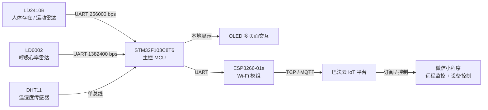

# 多模态感知智能家居健康管理系统

> 基于 **STM32F103 + 双毫米波雷达** 的非接触式家居健康监测系统：人体存在、运动状态、呼吸频率、温湿度多模态感知，经 Wi-Fi 上云联动微信小程序，整机物料成本约 **188 元**。


毕业设计 · 独立完成 · 2025.10 – 2026.05

---

## 项目亮点

- **非接触 + 隐私友好**：纯毫米波雷达感知，无摄像头、无需佩戴，适合老人与儿童家居场景。
- **多模态融合**：双雷达（存在/运动 + 呼吸心率）+ 温湿度，三路传感器并行采集、统一汇聚上报。
- **协议栈全自主实现**：LD2410B 定长帧与 LD6002 变长帧两套解析协议栈，含双重校验和与误同步保护，在 1382400 bps 非标波特率下零丢字节。
- **端到端链路打通**：传感器 → STM32 → ESP8266 → 云平台 → 微信小程序，实测延迟 < 5 秒。
- **工程可靠性**：连续 72 小时无 MCU 重启，整机成本压到 138 元以内。

---

## 实测性能指标

| 指标 | 结果 | 测试方法 |
| --- | --- | --- |
| 人体存在检测准确率 | **96 %** | 4–5 m 范围内人为进出 100 次，显示与实际一致计为正确 |
| 呼吸频率误差 | **± 4 bpm** | 手机秒表人工计数为基准，各测 10 次取绝对误差均值（工程级精度） |
| 端到端云端延迟 | **< 5 秒** | 手机录屏逐帧分析「传感器变化 → 小程序刷新」时间差 |
| 连续稳定运行 | **72 小时无重启** | 长时间运行 + 失败计数 / 自动重连 / 防抖机制 |
| 整机物料成本 | **约 188 元** | 低于 150 元设计目标 |

---

## 系统架构



**电源设计要点**：LD6002 对电源纹波敏感，采用低纹波 LDO 独立供电；ESP8266 启动浪涌大，板载 LDO 拉不动，增设独立 LDO + 大电容滤波。

---

## 软件架构（四级分层）

| 层 | 职责 | 代表内容 |
| --- | --- | --- |
| 应用层 | 主循环调度、业务编排 | `main.c` |
| 设备层 | 封装具体芯片逻辑 | LD2410B / LD6002 / DHT11 / ESP8266 / OLED 驱动 |
| 组件层 | 可复用算法模块 | 三道过滤、久坐状态机、环形缓冲 |
| 驱动层 | 寄存器 / 外设操作 | USART、GPIO、定时器 |

> 分层好处：更换某个传感器只改设备层，不影响上层业务逻辑。

### 建议目录结构（按你的实际代码调整）

```text
.
├── App/                 # 应用层
│   └── main.c
├── Device/              # 设备层（芯片逻辑封装）
│   ├── ld2410b.c / .h
│   ├── ld6002.c  / .h
│   ├── dht11.c   / .h
│   ├── esp8266.c / .h
│   └── oled.c    / .h
├── Component/           # 组件层（可复用模块）
│   ├── filter.c     / .h    # 呼吸频率三道过滤
│   ├── sedentary.c  / .h    # 久坐识别状态机
│   └── ringbuffer.c / .h    # 环形缓冲区
├── Driver/              # 驱动层
│   ├── usart.c / .h
│   ├── gpio.c  / .h
│   └── timer.c / .h
├── Doc/                 # 文档、框图、演示截图
└── README.md
```

---

## 核心技术与算法

### 1. 雷达帧解析协议栈

- **LD2410B（23 字节定长帧）**：两状态状态机，中断收字节 + 主循环消费；新增目标状态字节合法性校验（仅 0x00–0x03），过滤误同步脏帧。
- **LD6002（变长帧 · 1382400 bps）**：九状态状态机（SOF → ID → LEN → HEAD_CRC → DATA → DATA_CRC → EOF），头校验 + 数据校验双重 8 位累加和；任意校验失败整帧丢弃并重同步。
- **大小端 / 浮点解码**：LD6002 与 STM32 同为小端，用 `union` 联合体把 4 字节直接映射为 IEEE-754 `float`，无需手动翻转。
- **中断与主循环解耦**：环形缓冲区承接高速 UART 中断数据，主循环消费，保证高速数据流下零丢字节。

相关函数：`USART1_IRQHandler()`、`ProcessLD2410Frame()`、`USART3_IRQHandler()`、`LD6002_Process()`、`bytes_to_float_le()`

### 2. 久坐识别状态机

四态状态机 `IDLE → SITTING → LIGHT → HEAVY`，含非对称防抖：复位需运动持续 30 s，避免坐姿微动作误清零。

相关函数：`Sedentary_Update()`、`Sedentary_OnTargetState()`、`Sedentary_GetWarnLevel()`

### 3. 呼吸频率三道级联过滤

```text
LD6002_GetBreathRate()
   └─ Filter_RangeCheck()        合理范围过滤（保留 5~60 bpm）
        └─ Filter_MedianFilter5()  5 点中位数滤波（抑制脉冲噪声）
             └─ Filter_TimeConsistency()  时间一致性约束（相邻差 ≤ ±5 bpm）
                  └─ Breath_GetStableValue()  输出稳定值
```

### 4. 云端通信链路

ESP8266 通过 AT 指令建立 TCP 长连接接入巴法云；设计失败计数 + 自动重连机制提升长时间运行可靠性。

---

##  编译与烧录

- **开发环境**：Keil MDK 5（或 STM32CubeIDE）
- **依赖**：STM32F10x 标准外设库（或 HAL 库）
- **烧录**：ST-Link / J-Link，下载至 STM32F103C8T6
- **云端**：在巴法云创建设备与对应主题（人体状态 / 呼吸 / 温湿度 / 久坐告警），将 SSID、密码、设备私钥填入 `esp8266.c` 配置区

```bash
# 克隆仓库
git clone https://github.com/<你的GitHub用户名>/<仓库名>.git
```

---

## 演示

> 在此放置演示视频链接或 GIF、OLED 各页面截图、微信小程序界面截图。

---

## 未来工作

- 申请 LD6002 原始相位数据接口，自主实现时域峰值检测 / FFT / 零频滤波等算法
- 引入卡尔曼滤波或轻量神经网络，提升动态干扰下的鲁棒性
- 升级到标准 MQTT 协议；迁移至 FreeRTOS 多任务架构
- 扩展跌倒检测、姿态估计等更多健康指标

---

## 作者

**罗金铭** · 郑州大学 电子信息工程

- 📮 2508236863@qq.com
